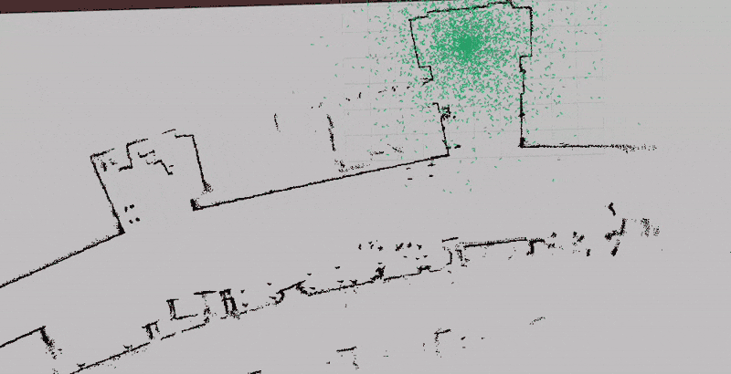

# Robot Localization 
Andrew Kurtz and Ananth Kutuva's robot localization project.

This is the base repo for the Olin Computational Robotics Robot Localization project, our final report is located in `Robot_Localization_Report.pdf`.

## Demo
This is a demo of the particle filter in action when initialized with a pose estimate.

The green arrows are particles, and the blue arrow is the estimated robot pose. The red dots show the robot’s current laser scan transformed into the map frame using the estimated robot pose. The better the red dots align with the map, the better the pose.

  

